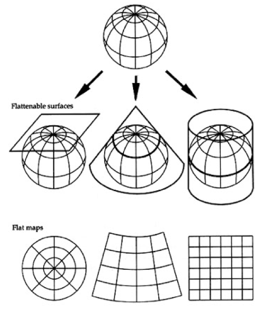

```{r setup, include=FALSE}
knitr::opts_chunk$set(echo = TRUE, cache = TRUE, fig.align = "center")
library(emo)
```

En este taller veremos como visualizar datos geoespaciales con R, sin embargo, los 
paquetes de R permiten hacer mucho más que sólo 
visualizar. Para aprender más sobre esto ver [Geocomputation with R](https://geocompr.robinlovelace.net/intro.html) (@lovelace_geocomputation_2019).

Repositorio: [github.com/tereom/taller-mapas-mv](https://github.com/tereom/taller-mapas-mv/tree/master)


# {.tabset}

## `r emo::ji("map")`Estáticos 

Usaremos los paquetes `tidyverse` [@tidyverse] y `sf`[@sf].

```{r, message=FALSE, warning=FALSE}
library(tidyverse) # arreglar datos (dplyr) y graficar (ggplot2)
library(sf) # simple features para leer y manipular datos espaciales
```


### `r ji("dog")` Nuestro primer mapa

* **Objetivo**: Un mapa de población por departamento de Uruguay

* **¿Qué necesito?** 
  1) Datos que determinan la forma de los departamentos (**shapefile**),  
  2) Datos de población por departamento (**csv**)

Los datos geoespaciales de los departamentos los obtenemos de 
[mapas vectoriales del INE](https://ine.gub.uy/mapas-vectoriales) y usaremos
la función `st_read()` para leerlos:

```{r}
depart_uy <- st_read("datos/ine_depto/ine_depto.shp")
```
Los podemos graficar directo con `plot(depart_uy)` o con ggplot (`r ji("heart")`)
en el segundo caso usamos `geom_sf()` para agregar la capa de coordenadas:

```{r}
ggplot(depart_uy) +
  geom_sf()
```

Como vemos en este ejemplo, utilizamos la función `st_read()` que recibe como
argumento la ruta al archivo con terminación `.shp` (puede ser a la carpeta) y 
la asigna a `depart_uy`.

Si inspeccionamos el objeto `depart_uy` descubrimos que es un poco familiar (y 
un poco nuevo), lo familiar es que es una tabla de datos de tipo `data.frame`, 
con una columna adicional de **geometría** que almacena la información de la 
geometría espacial. 

```{r}
depart_uy
class(depart_uy)
```
En la gráfica podemos colorear (como en cuaqluier ggplot) los polígonos 
utilizando con el valor de alguna de las columnas del `data.frame`.

```{r}
ggplot(depart_uy) +
  geom_sf(aes(fill = AREA_KM2_))
```

También podemos unirle una tabla de datos externa, por ejemplo de población ([datos de juntas departamentales](https://catalogodatos.gub.uy/dataset/uruguay-atp-datos-basicos-de-las-19-juntas-departamentales)) como lo haríamos de normal:

```{r, message=FALSE}
basicos <- read_csv("datos/datosbasicosjds.csv")
glimpse(basicos %>% select(1:10))

# un poco de limpieza para poder unir las tablas
depart_pob <- basicos %>% 
  select(nombre = `Junta Departamental`, pob = `Población`) %>% 
  mutate(nombre = janitor::make_clean_names(nombre), 
         pob = as.numeric(str_remove_all(pob, "\\.")))

depart_uy_pob <- depart_uy %>% 
  mutate(nombre = janitor::make_clean_names(NOMBRE)) %>% 
  left_join(depart_pob)

ggplot(depart_uy_pob) +
  geom_sf(aes(fill = pob))
```

### `r ji("confused")` Lo no tan familiar

Ahora inspeccionamos el lado *nuevo* de nuestro objeto, para empezar notemos que
la carpeta de donde leímos los datos geospaciales tenía muchos archivos.

```{r}
fs::dir_tree("datos/ine_depto/")
```

Esto es porque un *shapefile* es un grupo de archivos que contienen geometrías 
e información de acuerdo a un estándar especificado por el Insituto de 
Investigación en Sistemas de Ecosistemas (ESRI). Nosotros tenemos los 
siguientes (para ine_depto):

* **nombre.shp**: es el archivo principal y contiene la geometría.

* **nombre.dbf:** es la base de datos y almacena la información de los atributos 
de los objetos.

```{r}
ine_depto_dbf <- foreign::read.dbf("datos/ine_depto/ine_depto.dbf")
head(ine_depto_dbf)
```

* **nombre.prj** (opcional): sistema de referencia de coordenadas (CRS: 
nos dan una manera estándar de describir ubicaciones en la Tierra).

```{r}
crs_depart <- st_crs(depart_uy)
crs_depart$input
```

* **nombre.shx**: almacena el índice de las entidades geométricas.

* **nombre.sbn** y **.sbx** (opcional): almacena índice espacial.

Como vimos en el ejemplo, `read_sf()` recibe la ruta a la carpeta o a alguno de 
los archivos de la capa de interés (en caso de tener varias capas en una carpeta
podemos indicar la ruta hasta alguno de los archivos: 
`read_sf("datos/ine_barrios/ine_barrios_mvd_nbi85.shp")` o utilizar el argumento
`layer`: `read_sf("datos/ine_barrios", layer = "ine_barrios_mvd_nbi85")`).

En cuanto a la columna **geometry** puede almacenar distintos tipos de geometría 
espacial, algunas de las geometrías más comunes están representadas en la 
siguiente imagen:

```{r, out.width = "400px",echo = FALSE, fig.cap= "@lovelace_geocomputation_2019 ([CC BY-NC-ND 4.0](https://creativecommons.org/licenses/by-nc-nd/4.0/))."}
knitr::include_graphics("imagenes/tipos_geom.png")
```

#### **Tu turno**

`r ji("world")` Grafica los polígonos de barrios de Montevideo (los archivos se 
encuentran en `datos/ine_barrios`).

```{r, include=FALSE}
barrios_mv <- read_sf("datos/ine_barrios/ine_barrios_mvd_nbi85.shp")

ggplot(barrios_mv) +
  geom_sf() 
```

`r ji("world")` Lee el archivo en `datos/uptu_cultura` y agrega las ubicaciones 
contenidas a la misma gráfica que los polígonos.

```{r, include = FALSE}
cultura_mv <- read_sf("datos/uptu_cultura/uptu_cultura.shp")
ggplot() +
  geom_sf(data = barrios_mv) +
  geom_sf(data = cultura_mv)
```

`r ji("world")` Describe la diferencia entre la geometría de los barrios de 
Montevideo y del archivo de cultura.

Notamos que podemos utilizar las operaciones usuales para transformar tablas de
datos, por ejemplo, si queremos crear una columna de tipo de establecimiento
usamos la función `mutate` de `dplyr`.

```{r, include=TRUE}
glimpse(cultura_mv)

cultura_mv <- cultura_mv %>% 
  mutate(tipo_establecimiento = case_when(
    str_detect(NOMBRE, "TEATRO") ~ "teatro", 
    str_detect(NOMBRE, "MUSEO") ~ "museo",
    str_detect(NOMBRE, "BIBLIOTECA") ~ "biblioteca",
    str_detect(NOMBRE, "CINE") ~ "cine",
    TRUE ~ "otro"
  ))
```

También tenemos disponibles las opciones típicas de ggplot como `facet_wrap()`.

```{r}
ggplot() +
  geom_sf(data = barrios_mv) +
  geom_sf(data = cultura_mv, color = "red", alpha = 0.8, size = 0.5) + 
  labs(title = "Establecimientos culturales en Montevideo", 
       color = "tipo") +
  theme_void() + 
  facet_wrap(~tipo_establecimiento)
```

### `r ji("document")` Crear uno objeto `sf` de una tabla de datos

Imaginemos que tenemos una tabla de datos georreferenciados, pueden ser 
datos colectados con gps en una encuesta o ubicaciones obtenidas de google maps.
Podemos convertir nuestro `data.frame` en un objeto de tipo `sf`, lo que debemos
hacer es indicar cuáles son las columnas que incluyen información geográfica.

* `r ji("crayon")` Utiliza google maps para ubicar un lugar especial para ti y 
agrégalo a [este documento](https://docs.google.com/spreadsheets/d/1h7n3dpjqGofWYtKf5ADCDAr8nT5U5UalMFq9nS3G_ew/edit#gid=0).

```{r}
library(googlesheets4)
url <- ("https://docs.google.com/spreadsheets/d/1h7n3dpjqGofWYtKf5ADCDAr8nT5U5UalMFq9nS3G_ew/edit#gid=0")
gs4_deauth()
colab <- read_sheet(url)
glimpse(colab)
```
Por ahora `colab` es simplemente un `data.frame`, 

```{r}
class(colab)
```

Lo podemos convertir a un objeto de clase `sf` con la función `st_as_sf`, 
indicando cuales son las columnas con información geográfica. De manera 
opcional podemos indicar también la información de la proyección (Google Maps
utiliza la 4326 para reportar).

```{r}
colab_longlat <- colab %>% 
  st_as_sf(coords = c("lat", "long")) %>% 
  st_sf(crs = 4326)

ggplot(colab_longlat) +
  geom_sf(aes(color = nombre))
```


## `r ji("ruler")` Proyecciones

Como vimos con nuestros primeros mapas, los objetos espaciales suelen tener
asociado un valor en sistema de referencia de coordenadas (**CRS**), en esta
sección explicamos a qué se refiere y porque es importante. 

La Tierra tiene forma elipsoidal y para llevar puntos en la Tierra a un mapa
debemos especificar un modelo de elipse, un punto de origen y dirección de los
ejes, y una estrategia para proyectar a un plano.

1. **Elipse:** Describe la forma de la Tierra, es una aproximación que no
ajusta a la perfección. Existen distintos elipsoides, algunos están diseñados
para ajustar toda la Tierra (WGS84, GRS80) y algunos ajustan únicamente por
regiones (NAD27). Los locales son más precisos para el área para la que fueron
diseñados pero no funcionan en otras partes del mundo.

```{r}
rgdal::projInfo(type = "ellps")[1:10, ]
```

2. **Datum:** Define un punto de origen para el sistema de coordenadas de la 
Tierra y la dirección de los ejes. El datum define el elipsoide que se usará
pero el sentido contrario no es cierto.

3. **Proyección:** Proyectar el elipsoide en un espacio de dos dimensiones. Es
decir pasar de longitud y latitud en el elipsoide a coordenadas de un mapa, esto
conlleva necesariamente una distorsión de la superficie. La estrategia usual es
utilizar _superficies de desarrollo_ y después aplanar la superficie. Todas 
las proyecciones inducen alguna distorsión y las proyecciones de los mapas serán 
diferentes.




Las distorsiones resultan en pérdidas de información que pueden ser en área, 
forma, distancia o dirección. Por ejemplo _Mercator_ preserva dirección y es 
útil para navegación: 

```{r}
states <- map_data("state")
usmap <- ggplot(states, aes(x=long, y=lat, group=group)) +
  geom_polygon(fill="white", colour="black")
usmap + coord_map("mercator")
```

Por su parte _Azimuthal Equal Area_ preserva area pero no dirección:

```{r, fig.show='hold'}
usmap + coord_map("azequalarea") 
```

En particular en investigación es común usar _Universal Transverse Mercator 
(UTM)_ porque preserva ángulos y dirección pero distorsiona distancia. Para
minimizar la distorsión se divide la Tierra en 60 regiones y utiliza una 
proyección (de secantes) en cada una. Esta es la proyección más común para 
[Uruguay](https://siglibreuruguay.wordpress.com/2015/12/23/sistemas-de-referencia-de-coordenadas/).

 con licencia [CC-BY 3.0](https://creativecommons.org/licenses/by-sa/3.0/deed.es)](imagenes/Utm-zones.jpeg)

En R podemos ver la lista de proyecciones con la siguiente instrucción:

```{r}
# 135 proyecciones distintas
rgdal::projInfo(type="proj")[1:20, ]
```

Es posible trabajar con datos no proyectados (longitud/latitud), a estos se les
determina coordenadas geográficas.

### Sistemas de referencia de coordenadas (CRS)

Los CRS nos dan una manera estándar de describir ubicaciones en la Tierra, una 
notación común que se utiliza para describir un CRS es proj4string
y se ven como:

```{r}
st_crs(barrios_mv)$proj4string # cartesianas
st_crs(colab_longlat)$proj4string # geográficas
```

También se puede usar el código ESPG asociado.

```{r}
st_crs(barrios_mv)
```


### **Tu turno**

`r emo::ji("map")` En un editor de texto abre el archivo `.prj` de alguno de los
conjuntos de datos geoespaciales que hemos utilizado.

`r emo::ji("map")` ¿Cuáles hemos usado hasta ahora?

## `r emo::ji("pin")` Interactivos

Para hacer mapas interactivos usaremos el paquete `leaflet` [@leaflet]

```{r}
library(leaflet)
```

*Leaflet* es una librería de JavaScript para realizar mapas interactivos, el 
paquete de R nos permite utilizarla desde R.

### `r ji("museum")` Puntos culturales con Leaflet

Leaflet recibe datos geoespaciales con proyección **CRS 4326** (al igual que las 
coordenadas que copiamos de GoogleMaps). Por ellos si queremos graficar los puntos 
culturales debemos comenzar reproyectando:


```{r, error = TRUE}
cultura_mv_longlat <- st_transform(cultura_mv, 4326)
```


Ahora graficamos, la sintaxis de leaflet es similar a la de ggplot, pero usamos 
`%>%` en lugar de `+`:


```{r, error = TRUE}
leaflet(data = cultura_mv_longlat) %>% 
  addTiles() %>% 
  addCircles()
```

La función `addTiles()` agrega las *tejas* del fondo. En este ejemplo agregagmos
marcadores que muestran la ubicación de los sitios culturales de Montevideo, 
podemos añadir información de variables en los datos, por ejemplo, el nombre
de la atracción. Y con `addCircles()` agregamos la geometría de puntos representados con 
círculos.

```{r}
leaflet(data = cultura_mv_longlat) %>% 
  addTiles() %>% 
  addMarkers(popup = ~NOMBRE)
```

Con leaflet hay mucha flexibilidad, podemos meter html a las etiquetas o definir
nuestros propios íconos, en [el sitio](https://rstudio.github.io/leaflet/) se
explica claramente con ejemplos.

```{r}
rLadiesIcon <- makeIcon(
  iconUrl = "https://raw.githubusercontent.com/rladies/starter-kit/master/logo/R-LadiesGlobal_CMYK_offline_LogoOnly.svg",
  iconWidth = 38, iconHeight = 38
)

leaflet(data = colab_longlat) %>% 
  addTiles() %>% 
  addMarkers(popup = ~nombre, icon = rLadiesIcon) 
```

También podemos agregar objetos espaciales de otros tipos, para polígonos se 
utiliza `addPolygons()`.

```{r}
barrios_longlat <- barrios_mv %>% 
  st_transform(crs = 4326)
leaflet(data = barrios_longlat) %>% 
  addTiles() %>% 
  addPolygons() 
```

```{r, eval=FALSE, include=FALSE}
depart_uy_pob %<>% st_transform(4326)
qpal <- colorQuantile("Blues", depart_uy_pob$pob, n = 7)
leaflet(data = depart_uy_pob) %>% 
  addTiles() %>% 
  addPolygons(stroke = FALSE, color = ~qpal(pob), fillOpacity = 1) 
```

#### **Tu turno**

Agrega al siguiente código la ubicación de los puntos de interés de Montevideo.

```{r, eval=FALSE}
leaflet(data = colab) %>% 
  addTiles() %>% 
  addMarkers(popup = ~nombre, icon = rLadiesIcon) 
```

Experimenta con otros fondos, utiliza la función `addProviderTiles()` y elige
un fondo de [aquí](http://leaflet-extras.github.io/leaflet-providers/preview/index.html).

```{r, eval=FALSE}
leaflet(data = colab) %>% 
  addProviderTiles(providers$Stamen.Watercolor) %>% 
  addMarkers(popup = ~nombre, icon = rLadiesIcon) 
```

## `r ji("math")`Extra: Operaciones

Las operaciones con datos geoespaciales van más allá del alcance de este taller
pero aquí hay algunos ejemplos de lo que se puede hacer.

* Área de polígonos (si no incluyera en los datos).

```{r}
barrios_mv %>% 
  mutate(area = st_area(geometry))
```

* En que barrio están los museos?

```{r}
barrios_cultura_mv <- barrios_mv %>%
    st_join(cultura_mv, join = st_intersects) # usualmente st_within es más apropiado 

barrios_cultura_mv %>% 
  st_drop_geometry() %>% 
  group_by(NOMBBARR) %>% 
  summarise(n_lugares = sum(!is.na(NOMBRE))) %>% 
  arrange(-n_lugares) 
```

* Distancia entre puntos.

```{r}
colab_longlat %>% 
  st_distance()
```


## `r ji("book")`Referencias


