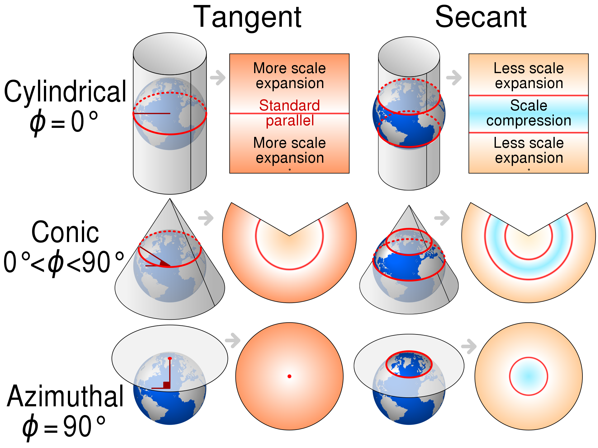
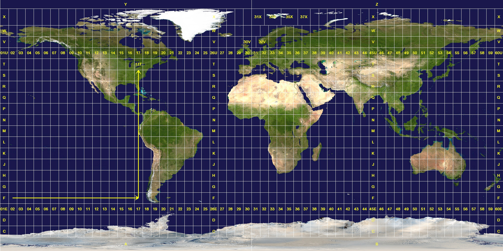

```{r setup, include=FALSE}
knitr::opts_chunk$set(echo = TRUE, cache = TRUE, fig.align = "center", 
                      list(width = 90))
library(emo)
```

```{r, echo=FALSE}
library(metathis)
meta() %>% 
  meta_name("notas-taller" = "tereom/mapas-taller-mv") %>% 
  meta_viewport() %>% 
  meta_social(
    image = "https://i.ibb.co/FXN1GTx/card.png",
    image_alt = "Mapa de Montevideo con puntos culturales",
    twitter_card_type = "summary"
    )
```

En este taller veremos como visualizar datos geoespaciales (vectoriales) con R, 
sin embargo, los paquetes de R permiten hacer mucho más que sólo 
visualizar. Para aprender más sobre esto ver [Geocomputation with R](https://geocompr.robinlovelace.net/intro.html) [@lovelace_geocomputation_2019].

## `r emo::ji("computer")`Preparación

Instala los paquetes y descarga el material del taller.

```{r, eval=FALSE}
install.packages(c("usethis", "tidyverse", "sf", "leaflet"))
usethis::use_course("https://github.com/tereom/taller-mapas-mv/blob/master/material.zip?raw=true")
```

## `r emo::ji("map")`Estáticos 

Usaremos los paquetes `tidyverse` [@tidyverse] y `sf`[@sf].

```{r, message=FALSE, warning=FALSE}
library(tidyverse) # arreglar datos (dplyr) y graficar (ggplot2)
library(sf) # simple features para leer y manipular datos espaciales
```


### `r ji("dog")` Nuestro primer mapa

* **Objetivo**: Un mapa de población por departamento de Uruguay

* **¿Qué necesito?** 
  1) Datos que determinan la forma de los departamentos (**shapefile**),  
  2) Datos de población por departamento (**csv**)

Los datos geoespaciales de los departamentos los obtenemos de 
[mapas vectoriales del INE](https://ine.gub.uy/mapas-vectoriales) y usaremos
la función `st_read()` para leerlos:

```{r}
depart_uy <- st_read("datos/ine_depto")
```

La función `st_read()` recibe como
argumento la ruta a la carpeta (puede ser al archivo con terminación `.shp`) y 
la asigna a `depart_uy`.

Los podemos graficar directo con `plot(depart_uy)` o con ggplot (`r ji("heart")`)
en el segundo caso usamos `geom_sf()` para agregar la capa de coordenadas:

```{r}
ggplot(depart_uy) +
  geom_sf()
```


Si inspeccionamos el objeto `depart_uy` descubrimos que es un poco familiar (y 
un poco nuevo), lo familiar es que es una tabla de datos de tipo `data.frame`, 
con una columna adicional de **geometría** que almacena la información de la 
geometría espacial. 

```{r, layout="l-body-outset"}
class(depart_uy)
glimpse(depart_uy)
```

En la gráfica podemos colorear (como en cuaqluier ggplot) los polígonos 
utilizando con el valor de alguna de las columnas del `data.frame`.

```{r}
ggplot(depart_uy) +
  geom_sf(aes(fill = AREA_KM2_))
```

También podemos unirle una tabla de datos externa, por ejemplo de población ([datos de juntas departamentales](https://catalogodatos.gub.uy/dataset/uruguay-atp-datos-basicos-de-las-19-juntas-departamentales)) como lo haríamos de normal:

```{r, message=FALSE}
basicos <- read_csv("datos/datosbasicosjds.csv")
glimpse(basicos %>% select(1:10, 38))

# un poco de limpieza para poder unir las tablas
depart_pob <- basicos %>% 
  select(nombre = `Junta Departamental`, pob = `Población`) %>% 
  mutate(nombre = janitor::make_clean_names(nombre), 
         pob = as.numeric(str_remove_all(pob, "\\.")))

depart_uy_pob <- depart_uy %>% 
  mutate(nombre = janitor::make_clean_names(NOMBRE)) %>% 
  left_join(depart_pob)

glimpse(depart_uy_pob)

```


<aside>
Utilizamos el paquete `janitor` para arreglar los nombres y que coincidan entre
las dos tablas que vamos a unir. Unimos con la función `left_join()` como haríamos
en una manipulación de datos ususal de `data.frame`s.
</aside>

Y graficamos nuestro mapa coloreado por población.

```{r}
ggplot(depart_uy_pob) +
  geom_sf(aes(fill = pob))
```


### `r ji("confused")` Lo no tan familiar

#### Shapefiles

Ahora inspeccionamos el lado *nuevo* de nuestro objeto, cuando leímos los datos
apuntamos a una carpeta:

```{r, eval=FALSE}
depart_uy <- st_read("datos/ine_depto")
```

esta carpeta de donde leímos los datos tiene muchos archivos.

```{r}
fs::dir_tree("datos/ine_depto/")
```

Esto es porque, en este ejemplo, nuestros datos vectoriales están almacenados en 
un *shapefile* (un formato muy común para datos geoespaciales). 

Un **shapefile** es un grupo de archivos que contienen geometrías e información 
de acuerdo a un estándar especificado por el Insituto de Investigación en 
Sistemas de Ecosistemas (ESRI). En nuestro ejemplo tenemos los siguientes:

* **nombre.shp**: es el archivo principal y contiene la geometría.

* **nombre.dbf**: es la base de datos asoiciada al objeto y almacena la 
información de los atributos de los objetos, en el caso de `ine_depto` hay un 
renglón por polígono, es decir, cada línea contiene las características de un 
departamento.

```{r}
ine_depto_dbf <- foreign::read.dbf("datos/ine_depto/ine_depto.dbf")
head(ine_depto_dbf)
```

* **nombre.prj** (opcional): sistema de referencia de coordenadas asociado 
a los datos.

```{r}
crs_depart <- st_crs(depart_uy)
crs_depart$input
```

* **nombre.shx**: almacena el índice de las entidades geométricas.

* **nombre.sbn** y **.sbx** (opcional): almacena índice espacial.

Como vimos en el ejemplo, `read_sf()` recibe la ruta a la carpeta o a alguno de 
los archivos de la capa de interés (en caso de tener varias capas en una carpeta
podemos indicar la ruta hasta alguno de los archivos): 
`read_sf("datos/ine_depto/ine_depto.shp")` o utilizar el argumento
`layer`: `read_sf("datos/ine_depto", layer = "ine_depto")`).

#### Geometrías

El segundo aspecto nuevo, es la columna **geometry** en los datos,

```{r}
depart_uy$geometry
```

ésta puede almacenar distintos tipos de datos vectoriales. 

Los tipos van aumentando en complejidad, el más simple serían puntos, cuya unión
forma líneas, con estos dos formas polígonos. Algunas de las geometrías más comunes están 
representadas en la siguiente imagen:

```{r, fig.width = 4.5, echo = FALSE, fig.cap= "@lovelace_geocomputation_2019 ([CC BY-NC-ND 4.0](https://creativecommons.org/licenses/by-nc-nd/4.0/))."}
knitr::include_graphics("imagenes/tipos_geom.png")
```

#### **Tu turno**

`r ji("world")` Grafica los polígonos de barrios de Montevideo (los archivos se 
encuentran en `datos/ine_barrios`).

```{r, include=FALSE}
barrios_mv <- read_sf("datos/ine_barrios/ine_barrios_mvd_nbi85.shp")

ggplot(barrios_mv) +
  geom_sf() 
```

`r ji("world")` Lee el archivo en `datos/uptu_cultura` y agrega las ubicaciones 
contenidas a la misma gráfica que los polígonos.

```{r, include = FALSE}
cultura_mv <- read_sf("datos/uptu_cultura/uptu_cultura.shp")
ggplot() +
  geom_sf(data = barrios_mv) +
  geom_sf(data = cultura_mv)
```

`r ji("world")` Describe la diferencia entre la geometría de los barrios de 
Montevideo y del archivo de cultura.


### `r ji("cartwheel")` Un ejemplo más

Notemos que podemos utilizar las operaciones usuales para transformar tablas de
datos, por ejemplo, si queremos crear una columna de tipo de establecimiento
usamos la función `mutate` de `dplyr`.

```{r, include=TRUE}
glimpse(cultura_mv)

cultura_mv <- cultura_mv %>% 
  mutate(tipo_establecimiento = case_when(
    str_detect(NOMBRE, "TEATRO") ~ "teatro", 
    str_detect(NOMBRE, "MUSEO") ~ "museo",
    str_detect(NOMBRE, "BIBLIOTECA") ~ "biblioteca",
    str_detect(NOMBRE, "CINE") ~ "cine",
    TRUE ~ "otro"
  ))
```

<aside>
Usamos la función `case_when()` para categorizar los puntos de interés culturales
de acuerdo al tipo, queremos esta variable para mostrar la información en un mapa.
</aside>

```{r}
glimpse(cultura_mv)
```

Veamos que tenemos disponibles las opciones típicas de ggplot como `facet_wrap()`.

```{r, layout="l-body-outset"}
ggplot() +
  geom_sf(data = barrios_mv) +
  geom_sf(data = cultura_mv, color = "red", alpha = 0.8, size = 0.5) + 
  labs(subtitle = "Establecimientos culturales en Montevideo", 
       color = "tipo") +
  theme_void() + 
  facet_wrap(~tipo_establecimiento)
```

### `r ji("document")` Crear uno objeto `sf` de una tabla de datos

Imaginemos que tenemos una tabla de datos georreferenciados, pueden ser 
datos colectados con gps en una encuesta o ubicaciones obtenidas de google maps.
Lo podemos almacenar en un `data.frame` que podemos a su vez convertir en un objeto de tipo `sf`, lo que debemos
hacer es indicar cuáles son las columnas que incluyen información geográfica.

* `r ji("crayon")` Utiliza google maps para ubicar un lugar especial para ti y 
agrégalo a [este documento](https://docs.google.com/spreadsheets/d/1h7n3dpjqGofWYtKf5ADCDAr8nT5U5UalMFq9nS3G_ew/edit#gid=0).

```{r}
library(googlesheets4)
url <- ("https://docs.google.com/spreadsheets/d/1h7n3dpjqGofWYtKf5ADCDAr8nT5U5UalMFq9nS3G_ew/edit#gid=0")
gs4_deauth()
colab <- read_sheet(url)
glimpse(colab)
```

Por ahora `colab` es simplemente un `data.frame`, 

```{r}
class(colab)
```

Lo podemos convertir a un objeto de clase `sf` con la función `st_as_sf`, 
indicando cuales son las columnas con información geográfica. De manera 
opcional podemos indicar también la información de la proyección (Google Maps
utiliza la 4326 para reportar).

```{r}
colab_longlat <- colab %>% 
  st_as_sf(coords = c("lat", "long")) %>% 
  st_sf(crs = 4326)

class(colab_longlat)
```

Y ahora lo podemos graficar con ggplot y `geom_sf()`.

```{r}
ggplot(colab_longlat) +
  geom_sf(aes(color = nombre))
```


## `r ji("ruler")` CRS y Proyecciones

Como vimos con nuestros primeros mapas, los objetos espaciales suelen tener
asociado un valor en sistema de referencia de coordenadas (**CRS**), en esta
sección explicamos a qué se refiere y porque es importante. 

La Tierra tiene forma elipsoidal y para ubicar puntos en la Tierra 
debemos especificar un modelo de elipse, un punto de origen y dirección de los
ejes, y una estrategia para proyectar a un plano.

1. **Elipse:** Describe la forma de la Tierra, es una aproximación que no
ajusta a la perfección. Existen distintos elipsoides, algunos están diseñados
para ajustar toda la Tierra (WGS84, GRS80) y algunos ajustan únicamente por
regiones (NAD27). Los locales son más precisos para el área para la que fueron
diseñados pero no funcionan en otras partes del mundo.

```{r, layout="l-body-outset"}
rgdal::projInfo(type = "ellps") %>% 
  rmarkdown::paged_table()
```

2. **Datum:** Define un punto de origen para el sistema de coordenadas de la 
Tierra y la dirección de los ejes. El datum define el elipsoide que se usará
pero el sentido contrario no es cierto.

```{r, fig.width=4, fig.height=3, echo = FALSE}
data_crs <- tibble(x = c(0, 10), y = c(0, 20), label = c("datum", "(10m, 20m)"))
ggplot(data_crs, aes(x, y, label = label)) +
  geom_hline(yintercept = 0) +
  geom_vline(xintercept = 0) +
  geom_point(color = "red", size = 2) +
  geom_label(nudge_x = 0.2, nudge_y = 1.5) + 
  xlim(-0.5, 11.5) +
  theme_bw()
```
<aside>
1. Las distancias deben tener unidades (metros en el ej.).
2. Se necesita un punto de referencia (*datum*).
</aside>

Los conceptos anteriores son la base de un sistema de coordenadas, es importante
recalcar que **no todos los datos geoespaciales usan el mismo sistema de 
coordenadas**. Y para ser representados en un mismo mapa debemos cuadrarlos.

3. **Proyección:** Nos permiten desplegar el elipsoide en un espacio de dos dimensiones, es
decir pasar de longitud y latitud en el elipsoide a coordenadas de un mapa, esto
facilita ciertas operaciones (por ejemplo. las longitudes y los ángulos son constantes
en dos dimensiones, en contraste con una esfera donde las líneas de longitud convergen en
los polos), sin embargo, conlleva necesariamente una distorsión. La estrategia usual
para proyectar es utilizar _superficies de desarrollo_ y después aplanar la superficie. 

```{r, fig.width = 6, echo = FALSE, fig.cap="[Comparación entre proyecciones tangente y secante cilíndirca, cónica y de azimut](https://en.wikipedia.org/wiki/Map_projection#/media/File:Comparison_of_cartography_surface_development.svg) con licencia [CC-BY 4.0](https://creativecommons.org/licenses/by-sa/4.0/)"}

```

<aside>
Es posible trabajar con datos no proyectados (longitud/latitud), a estos se les
determina coordenadas geográficas.
</aside>

Las distorsiones resultan en pérdidas de información que pueden ser en área, 
forma, distancia o dirección. Por ejemplo _Mercator_ preserva dirección y es 
útil para navegación: 

```{r, code_folding=TRUE}
states <- map_data("state")
usmap <- ggplot(states, aes(x=long, y=lat, group=group)) +
  geom_polygon(fill="white", colour="black")
usmap + coord_map("mercator")
```

Por su parte _Azimuthal Equal Area_ preserva area pero no dirección:

```{r, code_folding=TRUE}
usmap + coord_map("azequalarea") 
```

En particular en investigación es común usar _Universal Transverse Mercator 
(UTM)_ porque preserva ángulos y dirección (por lo que es común en sistemas de 
navegación). Para
minimizar la distorsión se divide la Tierra en 60 regiones y utiliza una 
proyección (de secantes) en cada una. Esta es la proyección más común para 
[Uruguay](https://siglibreuruguay.wordpress.com/2015/12/23/sistemas-de-referencia-de-coordenadas/).

<!--  con licencia [CC-BY 3.0](https://creativecommons.org/licenses/by-sa/3.0/deed.es)](imagenes/Utm-zones.jpeg) -->

```{r, fig.cap="[Husos y Zonas UTM](https://es.m.wikipedia.org/wiki/Archivo:Utm-zones.jpg) con licencia [CC-BY 3.0](https://creativecommons.org/licenses/by-sa/3.0/deed.es)", echo = FALSE, layout="l-body-outset"}



```


<!-- En R podemos ver la lista de proyecciones con la siguiente instrucción: -->

<!-- ```{r} -->
<!-- # 135 proyecciones distintas -->
<!-- rgdal::projInfo(type="proj")[1:20, ] -->
<!-- ``` -->


### `r ji("file")` Sistemas de referencia de coordenadas (CRS)

Como vimos arriba, los conjuntos de datos geoespaciales tienen asociado un 
sistema de referencia de coordenadas (y proyección si es el caso), 
Hay varias maneras de hacer referencia al sistema asociado a un conjunto de datos, 
una notación estándar que se utiliza para describir un CRS es proj4string
y se ven como:

```{r}
st_crs(barrios_mv)$proj4string # cartesianas
st_crs(colab_longlat)$proj4string # geográficas
```

También se puede usar el código ESPG asociado, los códigos EPSG. Los códigos 
**EPSG** (European Petroleum Survey Group) son códigos de 4 a 5 dígitos que representan 
definiciones de CRS:

```{r}
st_crs(32721)$proj4string
```

Hay más maneras de documentar el sistema de coordenadas, sin embargo las dos mencionadas son muy comunes.

#### **Tu turno**

`r emo::ji("map")` En un editor de texto abre el archivo `.prj` de alguno de los
conjuntos de datos geoespaciales que hemos utilizado.

`r emo::ji("map")` ¿Cuáles hemos usado hasta ahora?


Muchas veces es necesario transformar nuestros datos a otro sistema de coordenadas
geográficas, por ejemplo, si queremos trabajar con conjuntos de datos con 
distinto CRS, o para utilizar ciertas herramientas como *leaflet*.


## `r emo::ji("pin")` Interactivos

Para hacer mapas interactivos usaremos el paquete `leaflet` [@leaflet]:

```{r}
library(leaflet)
```

*Leaflet* es una librería de JavaScript para realizar mapas interactivos, el 
paquete de R nos permite utilizarla desde R.

### `r ji("museum")` Puntos culturales con Leaflet

Leaflet recibe datos geoespaciales con **CRS 4326** (al igual que las 
coordenadas que copiamos de GoogleMaps). Por ellos si queremos graficar los puntos 
culturales debemos comenzar reproyectando:


```{r, error = TRUE}
cultura_mv_longlat <- st_transform(cultura_mv, 4326)
```


Ahora graficamos, la sintaxis de leaflet es similar a la de ggplot, pero usamos 
`%>%` en lugar de `+`:


```{r, error = TRUE}
leaflet(data = cultura_mv_longlat) %>% 
  addTiles() %>% 
  addCircles()
```

La función `addTiles()` agrega las *tejas* del fondo. En este ejemplo agregagmos
marcadores que muestran la ubicación de los sitios culturales de Montevideo, 
podemos añadir información de variables en los datos, por ejemplo, el nombre
de la atracción. Y con `addCircles()` agregamos la geometría de puntos representados con 
círculos.

```{r}
leaflet(data = cultura_mv_longlat) %>% 
  addTiles() %>% 
  addMarkers(popup = ~NOMBRE)
```

Con leaflet hay mucha flexibilidad, podemos meter html a las etiquetas o definir
nuestros propios íconos, en [el sitio](https://rstudio.github.io/leaflet/) se
explica claramente con ejemplos.

```{r}
rLadiesIcon <- makeIcon(
  iconUrl = "https://raw.githubusercontent.com/rladies/starter-kit/master/logo/R-LadiesGlobal_CMYK_offline_LogoOnly.svg",
  iconWidth = 38, iconHeight = 38
)

leaflet(data = colab_longlat) %>% 
  addTiles() %>% 
  addMarkers(popup = ~nombre, icon = rLadiesIcon) 
```

También podemos agregar objetos espaciales de otros tipos, para polígonos se 
utiliza `addPolygons()`.

```{r}
barrios_longlat <- barrios_mv %>% 
  st_transform(crs = 4326)
leaflet(data = barrios_longlat) %>% 
  addTiles() %>% 
  addPolygons() 
```

```{r, eval=FALSE, include=FALSE}
depart_uy_pob %<>% st_transform(4326)
qpal <- colorQuantile("Blues", depart_uy_pob$pob, n = 7)
leaflet(data = depart_uy_pob) %>% 
  addTiles() %>% 
  addPolygons(stroke = FALSE, color = ~qpal(pob), fillOpacity = 1) 
```

#### **Tu turno**

`r ji("world")` ¿Qué ocurre si utilizas leaflet con los datos no transformados, 
es decir si utilizas `colab` en lugar de `colab_longlat`?

`r ji("world")` Agrega al siguiente código la ubicación de los puntos de interés de Montevideo.

```{r, eval=FALSE}
leaflet(data = colab_longlat) %>% 
  addTiles() %>% 
  addMarkers(popup = ~nombre, icon = rLadiesIcon) 
```

`r ji("world")` Experimenta con otros fondos, utiliza la función `addProviderTiles()` y elige
un fondo de [aquí](http://leaflet-extras.github.io/leaflet-providers/preview/index.html).

```{r, eval=FALSE}
leaflet(data = colab) %>% 
  addProviderTiles(providers$Stamen.Watercolor) %>% 
  addMarkers(popup = ~nombre, icon = rLadiesIcon) 
```

## `r ji("math")`Extra: Operaciones

Las operaciones con datos geoespaciales van más allá del alcance de este taller,
pero aquí hay algunos ejemplos de lo que se puede hacer.

* Área de polígonos (si no incluyera en los datos).

```{r}
barrios_mv %>% 
  mutate(area = st_area(geometry))
```

* En que barrio están los museos?

```{r}
barrios_cultura_mv <- barrios_mv %>%
    st_join(cultura_mv, join = st_intersects) # usualmente st_within es más apropiado 

barrios_cultura_mv %>% 
  st_drop_geometry() %>% 
  group_by(NOMBBARR) %>% 
  summarise(n_lugares = sum(!is.na(NOMBRE))) %>% 
  arrange(-n_lugares) 
```

* Distancia entre puntos.

```{r}
colab_longlat %>% 
  st_distance()
```

La *[cheatsheet](https://github.com/rstudio/cheatsheets/blob/master/sf.pdf)* del 
paquete `sf` describe operaciones geométricas disponibles, e incluye útiles
esquemas.

## Licencia {.appendix}

Texto y gráficas con licencia [Creative Commons Attribution CC BY 4.0](https://creativecommons.org/licenses/by/4.0/), a menos que se indique lo contrario o tengan otra fuente (indicado en la nota). Código en [https://github.com/tereom/taller-mapas-mv](https://github.com/tereom/taller-mapas-mv).
